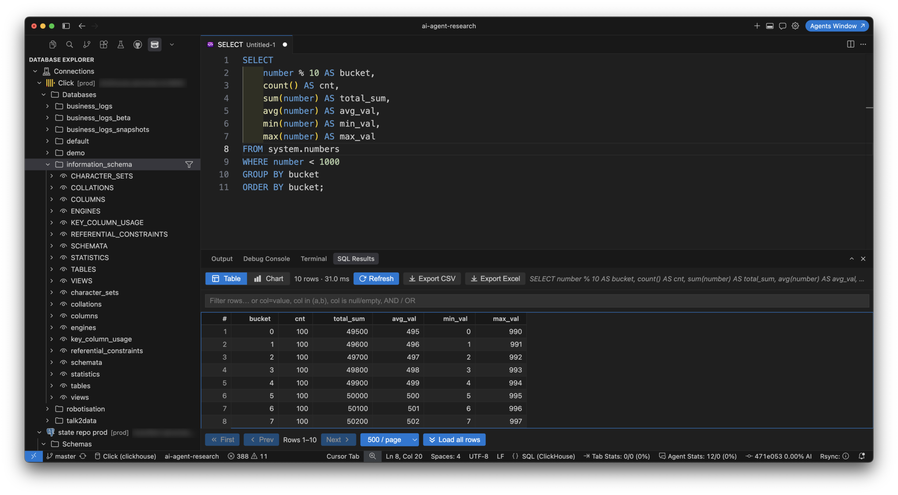
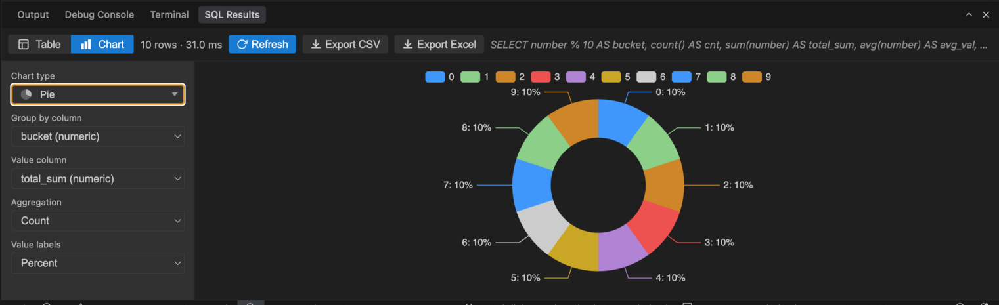

# SQL Studio

[](https://github.com/levragulin/cursor-sql-studio/actions/workflows/ci.yml)
[](LICENSE)
[](https://code.visualstudio.com/)

Write SQL, explore database schemas, run queries, and browse results in **VS Code** and **Cursor**.

> **Русская документация:** [README.ru.md](README.ru.md)

## Features

- SQL syntax highlighting for PostgreSQL, ClickHouse, T-SQL, MySQL, SQLite, and generic `.sql`
- **Database Explorer** — lazy schema tree (schemas/databases → tables, views, functions → columns)
- **Connection tags** — color-coded labels on connections (edit in the connection dialog or **Manage Tags**); shown in Explorer description and composite icons
- **Schema object filter** — inline filter on schema/database nodes to search tables, views, and functions by name; **Edit Filter** / **Reset Filter** when active
- Context menu on schema/database: **View ER Diagram** (Mermaid, pan/zoom/autofit) and **Get DBML** (copy to clipboard)
- Context menu on schema objects: Object Description, Sample Data, Export Data, Create SQL Query, Generate SELECT
- Click a table or view to preview data in the same results UI as query output
- **Create SQL Query** — new editor from Command Palette or connection context menu
- Run queries: **Cmd+Enter** / **Ctrl+Enter** (works when focus is outside the editor if one SQL file is open)
- **Run All in File**: **Cmd+Shift+Enter** / **Ctrl+Shift+Enter**; **Cancel Query** from editor toolbar while a query runs
- **Show Execution Plan**: **Shift+Cmd+E** / **Shift+Ctrl+E** (`EXPLAIN` per dialect; PostgreSQL optional `sqlStudio.explainAnalyze`); Results panel shows **Tree**, **Table**, and **Raw** views with search, metrics, and copy actions
- Warns when no connection is selected or the chosen connection is not active before running SQL
- Results panel: resizable columns (content-based default widths), sort, filter, pagination, copy row/value
- Charts: line, bar (columns or horizontal scroll for many categories), scatter, area, pie, heatmap; type picker icons; CSV/Excel export
- Formatted query errors (summary, database error code, collapsible stack trace)
- Connection passwords stored encrypted via VS Code **SecretStorage** (OS keychain)
- Connection dialog (webview) with dialect-specific fields and optional tags
- ClickHouse **Native (TCP, 9000)** and **HTTP (8123)** drivers
- Microsoft SQL Server via **ODBC** (pyodbc)
- Cursor Agent integration (rules template, MCP stub)

## Screenshots

**Query results (table)** — sort, filter, pagination, export:



**Query results (chart)** — pie, bar, scatter, heatmap from result columns. Pie charts with many categories use a scrollable legend; pinch-to-zoom (trackpad pinch or Ctrl/Cmd + scroll) on the chart area and trackpad scroll on the legend:



## Supported databases

| Database | Status | Notes |
|----------|--------|-------|
| PostgreSQL | Supported | Default dialect |
| ClickHouse | Supported | Native TCP or HTTP |
| Microsoft SQL Server | Supported | Requires [ODBC Driver for SQL Server](#microsoft-sql-server) on the host OS |
| MySQL | Supported | Via `pymysql` |
| SQLite | Supported | Local `.sqlite` / `.db` file path |

## Requirements

- **VS Code 1.85+** or **Cursor 0.40+**
- **[Node.js](https://nodejs.org/) 18+** — only for building from source
- **[uv](https://docs.astral.sh/uv/)** — **required at runtime**; the extension spawns the Python backend with `uv run`

```bash
# Install uv (macOS/Linux)
curl -LsSf https://astral.sh/uv/install.sh | sh

uv --version
```

If the backend fails to start, set **SQL Studio: Uv Path** in settings to the full path from `which uv`.

## Installation

### From VS Code Marketplace

1. Open **Extensions** (`Cmd+Shift+X` / `Ctrl+Shift+X`)
2. Search for **SQL Studio**
3. Click **Install**
4. Ensure `uv` is installed (see [Requirements](#requirements))
5. Reload the window if prompted

### From a `.vsix` file

```bash
git clone https://github.com/levragulin/cursor-sql-studio.git
cd cursor-sql-studio
just install && just package
# Install cursor-sql-studio-0.1.0.vsix via Extensions → ⋯ → Install from VSIX…
```

See [README.ru.md](README.ru.md) for detailed Cursor-specific install notes (drag & drop, CLI).

## Quick start

1. Open the **SQL Studio** activity bar → **Database Explorer**
2. Click **+** (Add Connection) or run **`SQL Studio: Add Connection`**
3. Choose database type, fill host/port/credentials, click **Test connection**, then **Save**
4. Right-click the connection → **Set Active Connection**
5. Open or create a `.sql` file, pick the connection in the status bar
6. Press **Cmd+Enter** / **Ctrl+Enter** to run the query at the cursor

## Keyboard shortcuts

| Action | macOS | Windows / Linux |
|--------|-------|-----------------|
| Run query at cursor | Cmd+Enter | Ctrl+Enter |
| Run all statements in file | Cmd+Shift+Enter | Ctrl+Shift+Enter |
| Show execution plan | Shift+Cmd+E | Shift+Ctrl+E |

## Connection fields by dialect

| Field | PostgreSQL | ClickHouse | SQL Server | MySQL | SQLite |
|-------|------------|------------|------------|-------|--------|
| Host / Port | yes | yes | yes | yes | — |
| Username / Password | yes | yes | yes | yes | optional |
| Database | required | optional | required | required | file path |
| Default port | 5432 | 9000 / 8123 | 1433 | 3306 | — |
| Extra | SSL, read-only | Native vs HTTP driver | TLS, read-only | SSL, read-only | read-only flag |

### ClickHouse: Native vs HTTP

| Mode | Port | Use when |
|------|------|----------|
| **Native (TCP)** | 9000 (9440 + TLS) | Internal network, same as TablePlus Native |
| **HTTP** | 8123 (8443 + TLS) | ClickHouse Cloud, HTTP-only access |

> Port **9000** does not work with the HTTP driver — select **Native** in the Driver field.

### Microsoft SQL Server

Connections use **pyodbc** and a **system ODBC driver**. Without it, test and queries fail with *Install Microsoft ODBC Driver for SQL Server*.

| OS | Install |
|----|---------|
| macOS | `brew tap microsoft/mssql-release https://github.com/Microsoft/homebrew-mssql-release && brew install msodbcsql18` |
| Windows | [ODBC Driver 18 for SQL Server](https://learn.microsoft.com/en-us/sql/connect/odbc/download-odbc-driver-for-sql-server) |
| Linux | [Microsoft docs](https://learn.microsoft.com/en-us/sql/connect/odbc/linux-mac/installing-the-microsoft-odbc-driver-for-sql-server) — package `msodbcsql18` |

Verify: `odbcinst -q -d` should list `ODBC Driver 18 for SQL Server` (or 17/13).

T-SQL files use extension `.tsql` and language **SQL (Microsoft SQL Server)**. Table preview uses `SELECT TOP N`.

## Working with the explorer

| Action | How |
|--------|-----|
| Preview / sample data | Click table/view or right-click → **Sample Data** |
| Object metadata | Right-click → **Object Description** |
| Export table | Right-click → **Export Data…** |
| New SQL from object | Right-click → **Create SQL Query** or **Generate SELECT** |
| Filter objects by name | Filter icon on schema/database node; **Edit Filter** / **Reset Filter** when active |
| Connection tags | Right-click connection → **Manage Tags**, or edit in the connection dialog |
| ER diagram | Right-click schema/database → **View ER Diagram** (pan, zoom, **Fit to view**, **Copy DBML**) |
| Run SQL | Open `.sql`, pick connection in status bar, **Cmd+Enter** / **Ctrl+Enter** |
| Format SQL | Command Palette → **SQL Studio: Format SQL** |
| Agent help | **SQL Studio: Ask Agent to Explain Query** |

## Settings

| Setting | Default | Description |
|---------|---------|-------------|
| `sqlStudio.uvPath` | `uv` | Path to the `uv` executable |
| `sqlStudio.previewRowLimit` | `1000` | Rows when previewing a table from Explorer |
| `sqlStudio.defaultRowLimit` | `10000` | Max rows per SQL query |
| `sqlStudio.warnOnLargeUnboundedSelect` | `true` | Warn before unbounded SELECT on large tables |
| `sqlStudio.largeTableRowThreshold` | `5000` | Estimated row count that triggers the warning |
| `sqlStudio.accentColor` | _(empty)_ | Primary accent for SQL Studio webviews (hex) |
| `sqlStudio.chartAccentColors` | `[]` | Chart series colors (hex array) |
| `sqlStudio.defaultDialect` | `postgres` | Default dialect for new files |
| `sqlStudio.autoAssociateSqlFiles` | `true` | Open `.sql` in SQL Studio language mode |
| `sqlStudio.promptForConnectionOnRun` | `false` | Ask for connection before each run |
| `sqlStudio.promptForConnectionOnOpen` | `true` | Ask for connection when opening `.sql` without a per-file binding |
| `sqlStudio.explainAnalyze` | `false` | PostgreSQL only: use `EXPLAIN ANALYZE` (executes the query). Other dialects use structured EXPLAIN output (JSON/XML/query plan) rendered as an interactive tree when supported. |

## Privacy and security

- **No telemetry** — the extension does not send usage data to the author or third parties.
- **Credentials** — passwords are stored only in VS Code **SecretStorage** (encrypted by the OS). They are not written to settings, logs, or MCP responses.
- **Queries** — SQL runs directly between your machine and the database you configure. The Python backend runs locally via `uv`.
- Use **read-only** connections when exploring production data.

## Cursor Agent

Templates in the repository:

- [`.cursor/rules/sql-agent.mdc`](.cursor/rules/sql-agent.mdc) — rules for `.sql` files in your workspace
- [`.cursor/mcp.json`](.cursor/mcp.json) — MCP server template (`sql-studio-mcp`, stub)

Copy `sql-agent.mdc` into your project's `.cursor/rules/` to enable agent-aware SQL editing.

## Architecture

| Layer | Stack | Role |
|-------|-------|------|
| Extension | TypeScript | UI, explorer, webviews, SecretStorage |
| Backend | Python + uv | JSON-RPC: queries, schema, export (`python/sql_studio/`) |
| Webview | React + Vite | Results table, connection dialog |

Backend layout (flat package under `python/`):

```
python/
├── sql_studio/          # Python package (server, drivers, dialect, export)
├── tests/               # pytest
├── pyproject.toml
└── uv.lock
```

Backend command (spawned automatically):

```bash
uv run --directory python sql-studio-server
```

## Development

```bash
just install && just build && just test
just package   # builds .vsix
```

Press **F5** in VS Code/Cursor for Extension Development Host.

Details: [CONTRIBUTING.md](CONTRIBUTING.md), [python/README.md](python/README.md), [AGENTS.md](AGENTS.md).

## Support

- [GitHub Issues](https://github.com/levragulin/cursor-sql-studio/issues) — bugs and feature requests
- [Security reports](SECURITY.md) — do not open public issues for vulnerabilities

## Author

**Lev Ragulin** — [leo@levragulin.ru](mailto:leo@levragulin.ru)

## Disclaimer

This software is provided **as is**, without warranty. You use SQL Studio at your own risk, including when connecting to production databases or running data-modifying statements.

## License

[The Beerware License (Revision 42)](LICENSE) — retain the notice; optional beer if we meet in person.
